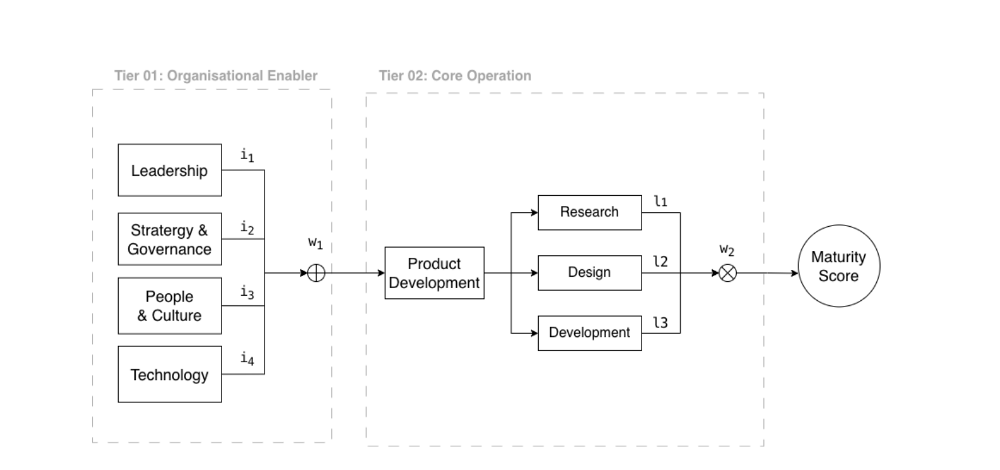
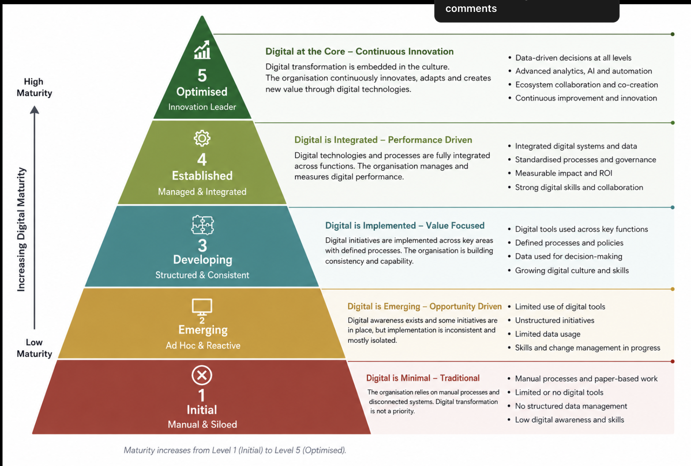

# Requirements Extract — verbatim source

Source: `requirements/Untitled document (2).pdf` (8 pages, text + 2 figures).
Text below was extracted from the PDF and lightly re-ordered into reading order.
Figures were extracted to `docs/assets/`.

> This file is the **evidence record**. `docs/plan.md` is the actionable plan.
> If the two ever disagree, this file wins and the plan should be corrected.

---

## Page 1 — Website Requirement

> Developing a Digital Maturity Model in the Apparel Industry
> **Website Requirement**
>
> I am planing to build the following maturity index calculation tool in vercer.
>
> I am planing to have 2 pages
>
> In the landing page of the website people can take start the survey
>
> All the questions here, tiers and their weights should be configurable using a conf.yaml file.
> depending on the yaml file questions should appear in the website one after the other in an
> interactive way. Once the survey is completed users can go through the answers submitted and
> get their final scores and recommendations to improve the digital maturity of the organization
>
> Users should be able to download their results and recommendations as a pdf. We will store the
> data in a json format but users might not able to retrieve a previously done survey
>
> There should be another page explaining the theory behind the model which is a static page

---

## Page 2 — Aim and Objectives of this Study

> This study addresses the lack of a practical tool to quantify digital maturity apparel industry. The
> primary aim of the research is to develop a data-driven framework to measure digital maturity
> and demonstrate the potential advantages of digital transformation. This framework will support
> apparel manufacturers in transitioning toward sustainable, technology-driven business models.
>
> The study combines qualitative and quantitative data, including interviews with industry
> professionals to understand current practices, challenges, and strategic priorities, along with
> quantitative data from questionnaires. The study will be used to develop a model capable of
> indexing the level of digital transformation in apparel organizations, supporting them in
> enhancing their digital transformation journey.

### General Information

1. Name:
2. Designation:
3. No. of years of Experience: Technical ______  Managerial ______
4. No of years of Experience in Digitalization ______
5. Highest level of Academic Qualification:

### Instructions

> For each factor, select one statement (1–5) that best describes the current situation in your
> organisation.

---

## Tier 1: Organisational Enablers

### 1. Leadership

**Question:** To what extent does management support and drive digital transformation?

1. **Initial:** Management provides little or no direction for digital transformation.
2. **Emerging:** Management supports some digital initiatives when needed.
3. **Developing:** Management has a clear digital vision and supports selected digital initiatives.
4. **Established:** Management actively drives digital transformation, provides resources, and monitors progress.
5. **Advanced:** Management continuously drives digital transformation, uses digital information for decision-making, and actively leads organisational change.

### 2. Strategy & Governance

**Question:** To what extent is digital transformation formally planned and managed in the organisation?

1. **Initial:** There is no formal digital strategy, roadmap, or governance structure.
2. **Emerging:** Digital initiatives are planned individually with limited formal guidance.
3. **Developing:** The organisation has some digital priorities, policies, and governance practices.
4. **Established:** Digital transformation is guided by a formal strategy, roadmap, governance structure, and regular reviews.
5. **Advanced:** Digital strategy and governance are continuously reviewed and improved based on performance, risks, and emerging technologies.

### 3. People & Culture

**Question:** To what extent are employees prepared and encouraged to support digital transformation?

1. **Initial:** Employees have limited digital skills and there is significant resistance to digital change.
2. **Emerging:** Basic digital training is provided to selected employees.
3. **Developing:** Employees receive regular digital training and participate in some digital initiatives.
4. **Established:** Continuous learning, employee participation, and cross-functional collaboration are well established.
5. **Advanced:** Employees actively identify digital opportunities, develop new digital skills, and contribute to digital innovation.

### 4. Technology

**Question:** To what extent are digital technologies and systems used and integrated across the organisation?

1. **Initial:** Digital technologies are limited and mainly used for basic activities.
2. **Emerging:** Some departments use digital tools, but systems are mostly separate.
3. **Developing:** Digital systems are used across several functions with some level of integration.
4. **Established:** Digital systems are well integrated and data is shared across relevant functions.
5. **Advanced:** The organisation continuously integrates and improves its digital technologies using advanced analytics, AI, automation, and emerging technologies.

---

## Tier 2: Core Operations

### 5. Research

**Question:** To what extent are digital technologies and data used for product-related research?

1. **Initial:** Research is mainly conducted using traditional methods with little use of digital tools.
2. **Emerging:** Digital platforms or databases are occasionally used for research.
3. **Developing:** Digital platforms and data are regularly used to support market, customer, and trend research.
4. **Established:** Digital analytics and advanced tools are systematically used to identify trends, customer needs, and product opportunities.
5. **Advanced:** AI, predictive analytics, and integrated data are continuously used to predict trends, customer preferences, and future product opportunities.

### 6. Design

**Question:** To what extent are digital technologies used in the product design process?

1. **Initial:** Product design is mainly conducted using traditional methods.
2. **Emerging:** Basic digital design tools are used by selected employees or departments.
3. **Developing:** Digital design and visualisation tools are regularly used, with some digital collaboration.
4. **Established:** Digital design, visualisation, file sharing, and collaboration are integrated into the design process.
5. **Advanced:** Advanced digital technologies such as 3D, AI, and virtual tools are continuously used for design optimisation, collaboration, and innovation.

### 7. Development

**Question:** To what extent are digital technologies used to manage and improve product development?

1. **Initial:** Product development is mainly conducted through physical and manual processes.
2. **Emerging:** Individual digital tools are used for activities such as pattern development, sampling, or fit evaluation.
3. **Developing:** Digital tools are regularly used for pattern development, 3D sampling, fit evaluation, or digital approval.
4. **Established:** Digital tools, simulation, digital workflows, and integrated systems are used throughout product development.
5. **Advanced:** Integrated systems, AI, analytics, simulation, and digital twins are used to continuously optimise product development and reduce time, cost, and physical sampling.

---

## Page 7 — Proposed Model



> On this based on the number they select it should multiply the weight
>
> ```
> I1 = 0.383
> I2 = 0.367
> I3 = 0.190
> I4 = 0.060
> Sum = 0.383 + 0.367 + 0.190 + 0.060 = 1
>
> L1 = 0.40
> L2 = 0.23
> L3 = 0.37
> Sum = 1
>
> W1 = 0.7
> W2 = 0.3
> Sum = 1
> ```
>
> Finally it should give the level of maturity

Figure labels (from `assets/model-diagram.png`):

- **Tier 01: Organisational Enabler** — Leadership (i₁), Stratergy & Governance (i₂),
  People & Culture (i₃), Technology (i₄) → ⊕ → **w₁**
- **Tier 02: Core Operation** — Product Development → Research (l₁), Design (l₂),
  Development (l₃) → **w₂**
- Both streams → **Maturity Score**

---

## Maturity Level Reference (figure)



| # | Level | Subtitle | Headline | Description |
|---|-------|----------|----------|-------------|
| 5 | Optimised | Innovation Leader | Digital at the Core – Continuous Innovation | Digital transformation is embedded in the culture. The organisation continuously innovates, adapts and creates new value through digital technologies. |
| 4 | Established | Managed & Integrated | Digital is Integrated – Performance Driven | Digital technologies and processes are fully integrated across functions. The organisation manages and measures digital performance. |
| 3 | Developing | Structured & Consistent | Digital is Implemented – Value Focused | Digital initiatives are implemented across key areas with defined processes. The organisation is building consistency and capability. |
| 2 | Emerging | Ad Hoc & Reactive | Digital is Emerging – Opportunity Driven | Digital awareness exists and some initiatives are in place, but implementation is inconsistent and mostly isolated. |
| 1 | Initial | Manual & Siloed | Digital is Minimal – Traditional | The organisation relies on manual processes and disconnected systems. Digital transformation is not a priority. |

Characteristics per level:

- **5 Optimised** — Data-driven decisions at all levels; Advanced analytics, AI and automation; Ecosystem collaboration and co-creation; Continuous improvement and innovation
- **4 Established** — Integrated digital systems and data; Standardised processes and governance; Measurable impact and ROI; Strong digital skills and collaboration
- **3 Developing** — Digital tools used across key functions; Defined processes and policies; Data used for decision-making; Growing digital culture and skills
- **2 Emerging** — Limited use of digital tools; Unstructured initiatives; Limited data usage; Skills and change management in progress
- **1 Initial** — Manual processes and paper-based work; Limited or no digital tools; No structured data management; Low digital awareness and skills

> Caption: *Maturity increases from Level 1 (Initial) to Level 5 (Optimised).*

Approximate figure colours (sampled): L1 `#B0392E`, L2 `#C9962F`, L3 `#2E7E8C`, L4 `#8DA84A`, L5 `#2E6B3A`.

---

## Naming inconsistency (carried forward deliberately)

The **per-factor** answer scale in the questionnaire labels level 5 as **"Advanced"**.
The **overall maturity pyramid** labels level 5 as **"Optimised"**.
Both labels are preserved in `conf.yaml`: `scale_labels` for answers, `maturity_levels` for the
final band. Do not silently unify them.
